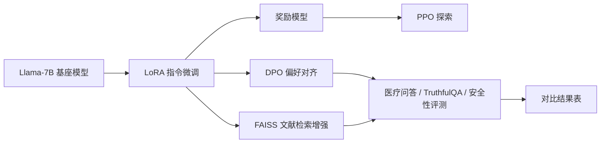

# 中文医疗大模型领域适配与对齐

面向中文医疗问答场景的大模型实验管线，覆盖 LoRA 参数高效微调、DPO 偏好对齐、奖励模型、PPO 探索、检索增强生成（RAG）以及真实性与安全性评测。仓库保留本人编写和整理的训练、推理、评测脚本与结果表，不包含模型权重、训练数据或医疗文献。

> 本项目仅用于技术研究与实验复现，输出不构成诊断、治疗或用药建议，也不能替代专业医疗人员判断。

## 实验管线



## 实验状态

| 阶段 | 实现与结果 | 状态 |
| --- | --- | --- |
| LoRA 指令微调 | 在 RTX 4090 24 GB 上对 Llama-7B 训练 2,000 steps，产出 Adapter | 已完成 |
| DPO 偏好对齐 | 基于 TRL、PEFT 与 4-bit 量化完成参数高效训练 | 已完成 |
| 奖励模型 | 完成奖励模型训练脚本与实验 | 已完成 |
| PPO | 完成训练脚本和问题定位，最终阶段受单卡显存限制 | 未完成 |
| RAG | 本地文献切分、向量化、FAISS 检索与答案对照 | 已完成 |
| 评测 | 医疗问答、TruthfulQA 与高诱导安全问题测试 | 已完成 |

未完成的 PPO 阶段保留真实状态，不将脚本存在等同于实验完成。

## 代码导航

| 路径 | 作用 |
| --- | --- |
| `src/DPO/run_dpo.py` | 加载基座模型与 LoRA Adapter，执行 DPO 训练 |
| `src/DPO/run_dpo.sh` | DPO 参数与路径入口示例 |
| `src/PPO/train_reward_model.py` | 奖励模型训练 |
| `src/PPO/train_ppo.py` | 基于奖励信号的 PPO 训练探索 |
| `src/RAG/rag.py` | 文献加载、切分、向量检索和对照生成 |
| `src/benchmarks/` | 医疗问答、真实性与安全性测试脚本 |
| `results/` | 三组实验导出的 XLSX 对比结果 |

## DPO 配置

默认脚本面向单卡显存受限环境，通过 4-bit 量化和 LoRA 降低训练成本：

| 参数 | 默认值 |
| --- | --- |
| Batch size | 2 |
| Gradient accumulation | 32 |
| Epochs | 1 |
| Learning rate | `5e-7` |
| Precision | FP16 + 4-bit model loading |
| DPO beta | 0.1 |
| LoRA rank / alpha / dropout | 8 / 32 / 0.1 |
| Target modules | `q/k/v/o_proj`、`gate/down/up_proj` |

路径通过参数传入，模型和数据不写死在仓库中：

```bash
export MODEL_PATH=/path/to/base-model
export PEFT_PATH=/path/to/adapter
export DPO_DATASET_PATH=/path/to/dpo-dataset
bash src/DPO/run_dpo.sh
```

## RAG 设计

`src/RAG/rag.py` 使用 LangChain 组织检索链路：

1. 读取本地医学文献并清洗文本。
2. 按 500 字符切分、保留 100 字符重叠，降低长文上下文丢失。
3. 使用多语言 MiniLM 向量模型生成嵌入并构建 FAISS 索引。
4. 每次检索 Top-3 相关片段，将来源文档随答案一并返回。
5. 分别生成 RAG 与直接问答结果，导出 XLSX 便于人工比较。

脚本默认通过本地 HTTP 服务调用模型，并包含原实验机的 GPU 编号设置。运行前需根据环境修改服务地址、文献路径和 `CUDA_VISIBLE_DEVICES`。

## 环境与复现

建议使用具备 CUDA 的 Linux 环境，核心依赖包括 Python、PyTorch、Transformers、Datasets、PEFT、TRL、BitsAndBytes、LangChain、FAISS、Sentence Transformers、Unstructured 与 OpenPyXL。仓库未固定完整依赖锁文件，复现时应根据 CUDA/驱动版本建立独立环境并记录实际包版本。

模型权重、Adapter、训练/偏好数据、文献 PDF、FAISS 索引和缓存均未上传。运行者需要自行取得合法授权的数据和模型，并遵循相应许可证与隐私要求。

## 个人工作与归属

本人完成训练配置整理、DPO/PPO/RAG 与评测脚本调试、显存问题定位和结果对比。项目基于 [ChatMed](https://github.com/michaelwzh/ChatMed) 的公开工作开展二次实验；上游代码、模型与数据遵循各自许可证，本仓库不主张其所有权。
